# Pavement Damage Detection Report (Dataset 1)
## PSCI Evaluation (Ground Truth and Model 5) 

---

### Road Segment 1

<!-- 固定宽度 600px，可根据需要调整 -->
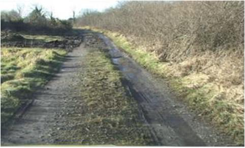

| **Metric**                   | **Ground Truth**     | **Model Prediction** |
|------------------------------|----------------------|----------------------|
| **Surface Defects (%)**      | 50.0                 | 50.0                 |
| **Pavement Defects (%)**     | 50.0                 | 50.0                 |
| **Structural Distresses (%)**| 80.0                 | 80.0                 |
| **Level (%)**                | **Level 1**          | **Level 1**          |

#### Explanation from model:#### Surface defects about 50%, pavement cracks about 50%, structural distresses about 80%.  
---

### Road Segment 2

<!-- 固定宽度 600px，可根据需要调整 -->
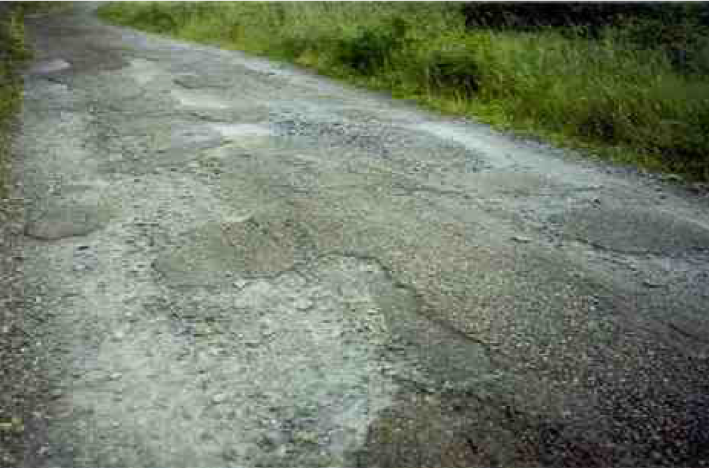

| **Metric**                   | **Ground Truth**     | **Model Prediction** |
|------------------------------|----------------------|----------------------|
| **Surface Defects (%)**      | 90.0                 | 0.0                 |
| **Pavement Defects (%)**     | 10.0                 | 0.0                 |
| **Structural Distresses (%)**| 90.0                 | 60.0                 |
| **Level (%)**                | **Level 1**          | **Level 2**          |

---

### Road Segment 3

<!-- 固定宽度 600px，可根据需要调整 -->
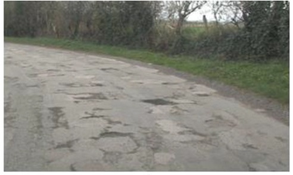

| **Metric**                   | **Ground Truth**     | **Model Prediction** |
|------------------------------|----------------------|----------------------|
| **Surface Defects (%)**      | 10.0                 | 0.0                 |
| **Pavement Defects (%)**     | 30.0                 | 0.0                 |
| **Structural Distresses (%)**| 60.0                 | 60.0                 |
| **Level (%)**                | **Level 2**          | **Level 2**          |

---

### Road Segment 4

<!-- 固定宽度 600px，可根据需要调整 -->
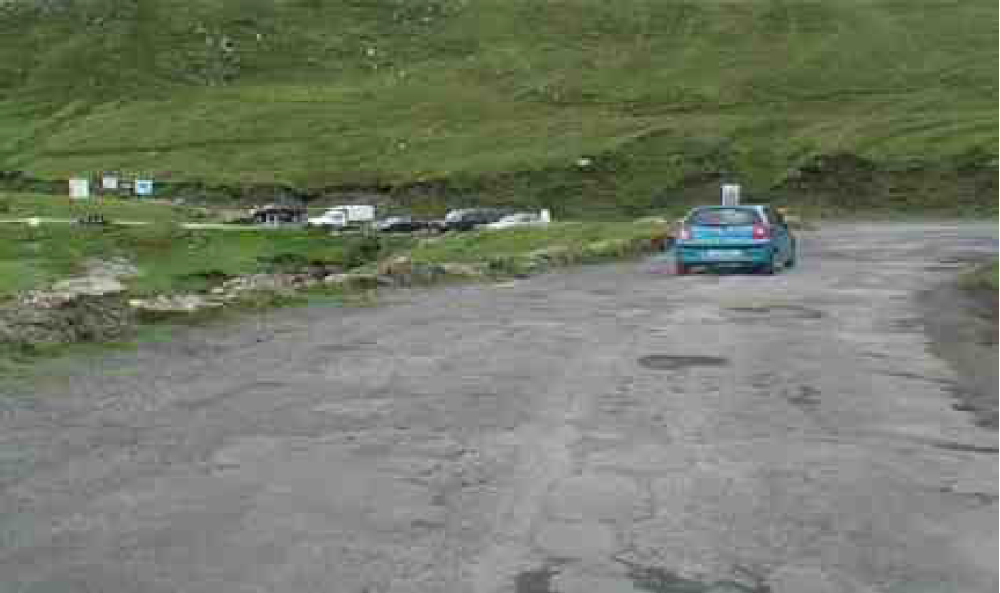

| **Metric**                   | **Ground Truth**     | **Model Prediction** |
|------------------------------|----------------------|----------------------|
| **Surface Defects (%)**      | 10.0                 | 0.0                 |
| **Pavement Defects (%)**     | 30.0                 | 10.0                 |
| **Structural Distresses (%)**| 60.0                 | 40.0                 |
| **Level (%)**                | **Level 2**          | **Level 4**          |

---

### Road Segment 5

<!-- 固定宽度 600px，可根据需要调整 -->
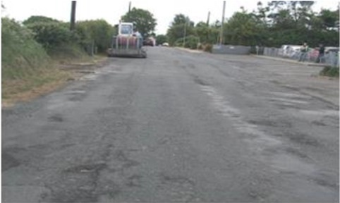

| **Metric**                   | **Ground Truth**     | **Model Prediction** |
|------------------------------|----------------------|----------------------|
| **Surface Defects (%)**      | 20.0                 | 30.0                 |
| **Pavement Defects (%)**     | 20.0                 | 10.0                 |
| **Structural Distresses (%)**| 40.0                 | 10.0                 |
| **Level (%)**                | **Level 3**          | **Level 4**          |

---

### Road Segment 6

<!-- 固定宽度 600px，可根据需要调整 -->
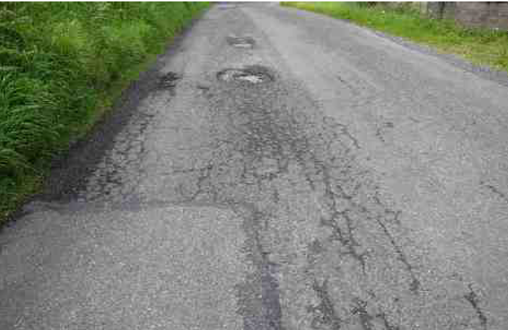

| **Metric**                   | **Ground Truth**     | **Model Prediction** |
|------------------------------|----------------------|----------------------|
| **Surface Defects (%)**      | 10.0                 | 0.0                 |
| **Pavement Defects (%)**     | 30.0                 | 20.0                 |
| **Structural Distresses (%)**| 30.0                 | 10.0                 |
| **Level (%)**                | **Level 3**          | **Level 4**          |

---

### Road Segment 7

<!-- 固定宽度 600px，可根据需要调整 -->
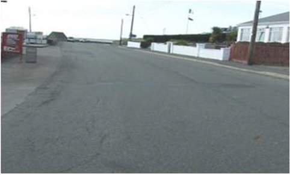

| **Metric**                   | **Ground Truth**     | **Model Prediction** |
|------------------------------|----------------------|----------------------|
| **Surface Defects (%)**      | 50.0                 | 15.0                 |
| **Pavement Defects (%)**     | 50.0                 | 10.0                 |
| **Structural Distresses (%)**| 80.0                 | 0.0                 |
| **Level (%)**                | **Level 4**          | **Level 6**          |

---

### Road Segment 8

<!-- 固定宽度 600px，可根据需要调整 -->
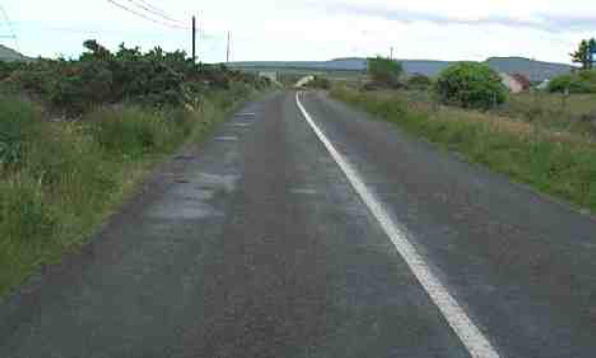

| **Metric**                   | **Ground Truth**     | **Model Prediction** |
|------------------------------|----------------------|----------------------|
| **Surface Defects (%)**      | 10.0                 | 15.0                 |
| **Pavement Defects (%)**     | 10.0                 | 5.0                 |
| **Structural Distresses (%)**| 10.0                 | 0.0                 |
| **Level (%)**                | **Level 4**          | **Level 6**          |

---

### Road Segment 9

<!-- 固定宽度 600px，可根据需要调整 -->
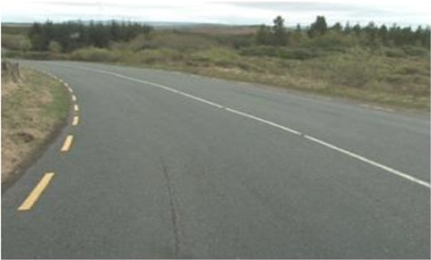

| **Metric**                   | **Ground Truth**     | **Model Prediction** |
|------------------------------|----------------------|----------------------|
| **Surface Defects (%)**      | 0.0                  | 0.0                  |
| **Pavement Defects (%)**     | 20.0                 | 20.0                 |
| **Structural Distresses (%)**| 0.0                  | 0.0                  |
| **Level (%)**                | **Level 5**          | **Level 5**          |

---

### Road Segment 10

<!-- 固定宽度 600px，可根据需要调整 -->
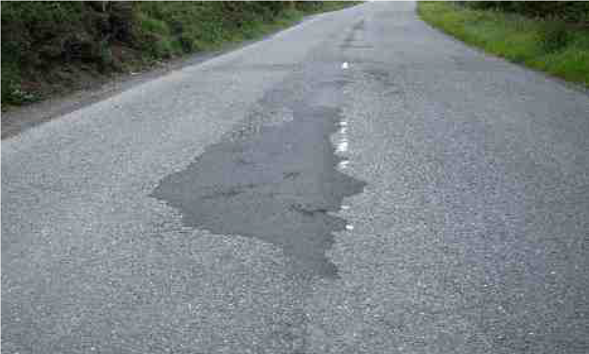

| **Metric**                   | **Ground Truth**     | **Model Prediction** |
|------------------------------|----------------------|----------------------|
| **Surface Defects (%)**      | 0.0                  | 0.0                  |
| **Pavement Defects (%)**     | 20.0                 | 0.0                  |
| **Structural Distresses (%)**| 0.0                  | 20.0                 |
| **Level (%)**                | **Level 5**          | **Level 6**          |

---

### Road Segment 11

<!-- 固定宽度 600px，可根据需要调整 -->
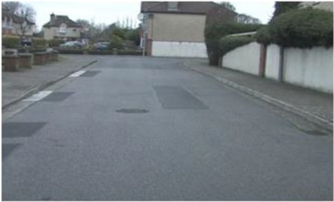

| **Metric**                   | **Ground Truth**     | **Model Prediction** |
|------------------------------|----------------------|----------------------|
| **Surface Defects (%)**      | 0.0                  | 0.0                  |
| **Pavement Defects (%)**     | 10.0                 | 10.0                 |
| **Structural Distresses (%)**| 10.0                 | 0.0                  |
| **Level (%)**                | **Level 6**          | **Level 6**          |

---

### Road Segment 12

<!-- 固定宽度 600px，可根据需要调整 -->
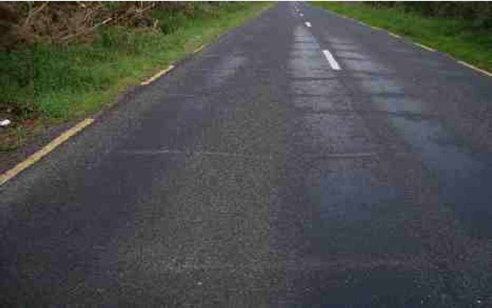

| **Metric**                   | **Ground Truth**     | **Model Prediction** |
|------------------------------|----------------------|----------------------|
| **Surface Defects (%)**      | 20.0                 | 20.0                 |
| **Pavement Defects (%)**     | 15.0                 | 0.0                  |
| **Structural Distresses (%)**| 5.0                  | 0.0                  |
| **Level (%)**                | **Level 6**          | **Level 8**          |

---

### Road Segment 13

<!-- 固定宽度 600px，可根据需要调整 -->
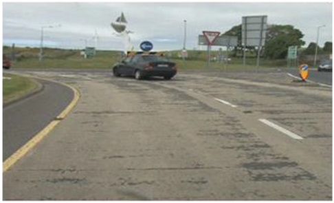

| **Metric**                   | **Ground Truth**     | **Model Prediction** |
|------------------------------|----------------------|----------------------|
| **Surface Defects (%)**      | 30.0                 | 30.0                 |
| **Pavement Defects (%)**     | 10.0                 | 20.0                 |
| **Structural Distresses (%)**| 0.0                  | 10.0                 |
| **Level (%)**                | **Level 7**          | **Level 5**          |

---

### Road Segment 14

<!-- 固定宽度 600px，可根据需要调整 -->
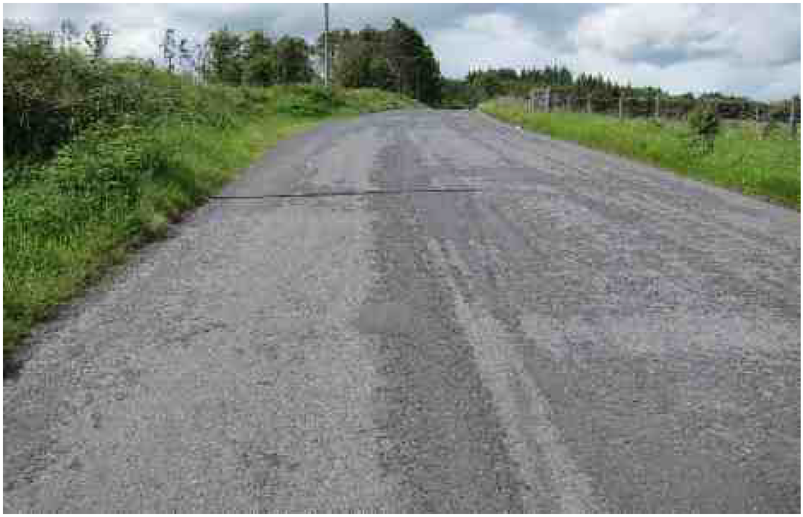

| **Metric**                   | **Ground Truth**     | **Model Prediction** |
|------------------------------|----------------------|----------------------|
| **Surface Defects (%)**      | 40.0                 | 40.0                 |
| **Pavement Defects (%)**     | 5.0                  | 0.0                  |
| **Structural Distresses (%)**| 0.0                  | 0.0                  |
| **Level (%)**                | **Level 7**          | **Level 7**          |

---

### Road Segment 15

<!-- 固定宽度 600px，可根据需要调整 -->
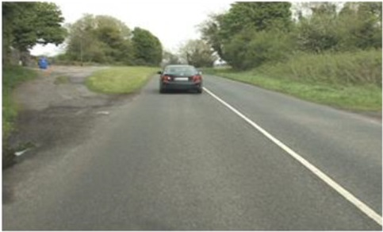

| **Metric**                   | **Ground Truth**     | **Model Prediction** |
|------------------------------|----------------------|----------------------|
| **Surface Defects (%)**      | 10.0                 | 0.0                  |
| **Pavement Defects (%)**     | 0.0                  | 0.0                  |
| **Structural Distresses (%)**| 0.0                  | 0.0                  |
| **Level (%)**                | **Level 8**          | **Level 10**         |

---

### Road Segment 16

<!-- 固定宽度 600px，可根据需要调整 -->
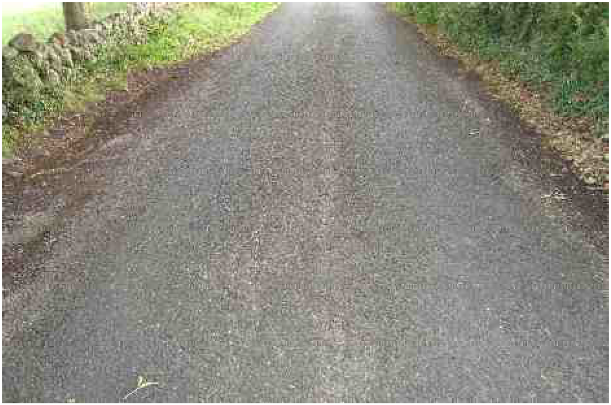

| **Metric**                   | **Ground Truth**     | **Model Prediction** |
|------------------------------|----------------------|----------------------|
| **Surface Defects (%)**      | 25.0                 | 20.0                 |
| **Pavement Defects (%)**     | 0.0                  | 0.0                  |
| **Structural Distresses (%)**| 0.0                  | 0.0                  |
| **Level (%)**                | **Level 8**          | **Level 8**          |

---

### Road Segment 17

<!-- 固定宽度 600px，可根据需要调整 -->
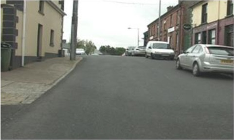

| **Metric**                   | **Ground Truth**     | **Model Prediction** |
|------------------------------|----------------------|----------------------|
| **Surface Defects (%)**      | 5.0                  | 0.0                  |
| **Pavement Defects (%)**     | 0.0                  | 0.0                  |
| **Structural Distresses (%)**| 0.0                  | 0.0                  |
| **Level (%)**                | **Level 9**          | **Level 10**         |

---

### Road Segment 18

<!-- 固定宽度 600px，可根据需要调整 -->
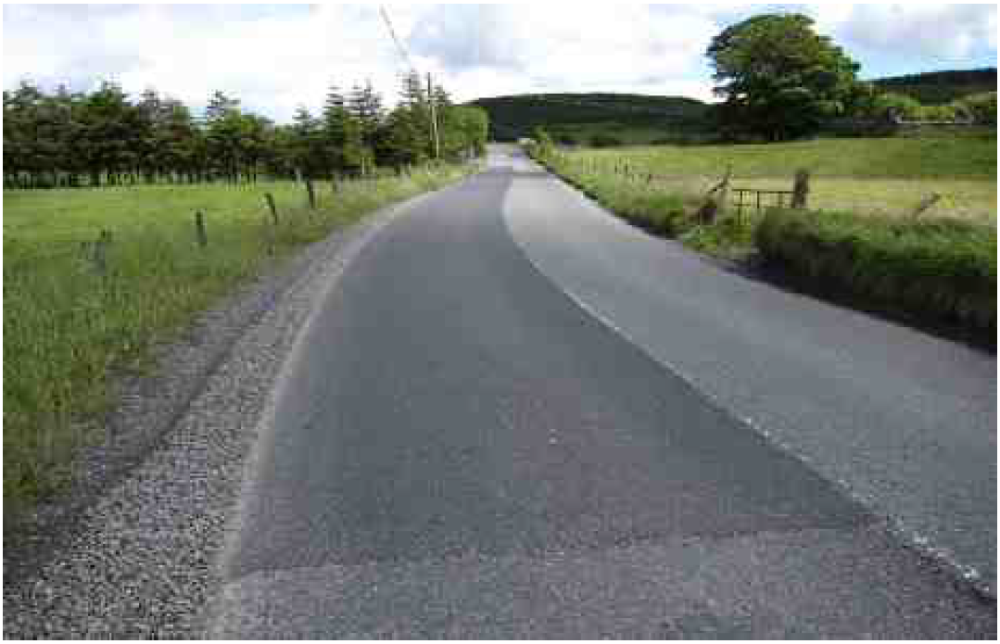

| **Metric**                   | **Ground Truth**     | **Model Prediction** |
|------------------------------|----------------------|----------------------|
| **Surface Defects (%)**      | 5.0                  | 5.0                  |
| **Pavement Defects (%)**     | 5.0                  | 0.0                  |
| **Structural Distresses (%)**| 0.0                  | 0.0                  |
| **Level (%)**                | **Level 9**          | **Level 9**          |

---

### Road Segment 19

<!-- 固定宽度 600px，可根据需要调整 -->
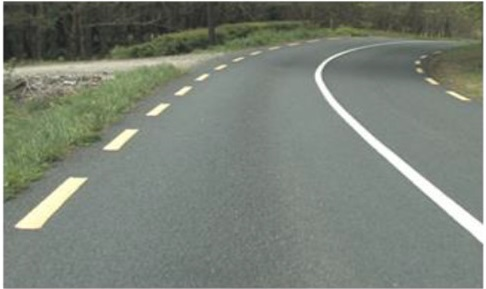

| **Metric**                   | **Ground Truth**     | **Model Prediction** |
|------------------------------|----------------------|----------------------|
| **Surface Defects (%)**      | 0.0                  | 0.0                  |
| **Pavement Defects (%)**     | 0.0                  | 0.0                  |
| **Structural Distresses (%)**| 0.0                  | 0.0                  |
| **Level (%)**                | **Level 10**         | **Level 10**         |

---

### Road Segment 20

<!-- 固定宽度 600px，可根据需要调整 -->
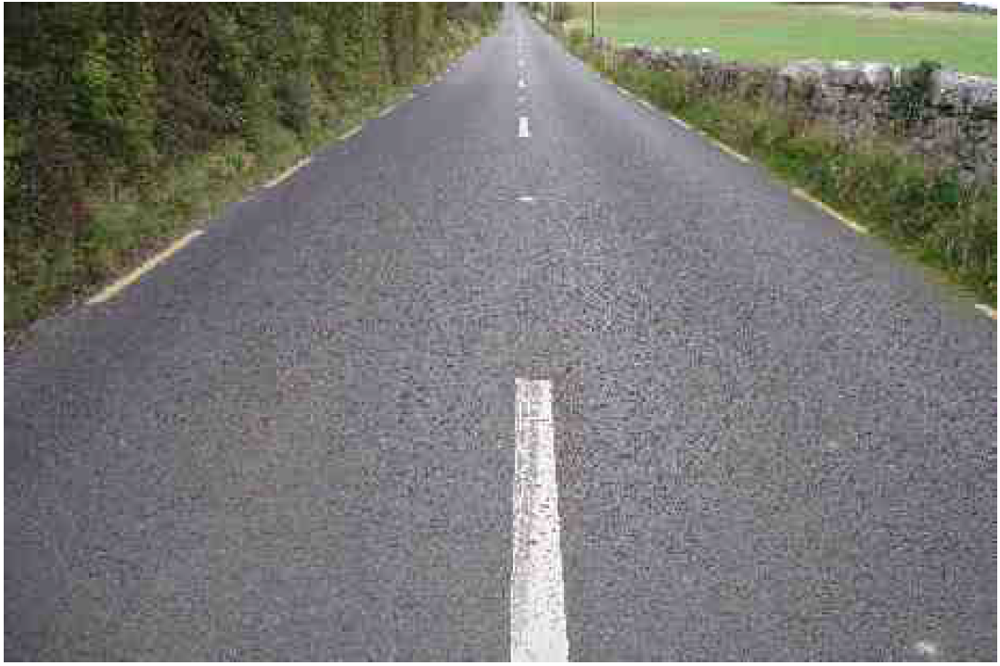

| **Metric**                   | **Ground Truth**     | **Model Prediction** |
|------------------------------|----------------------|----------------------|
| **Surface Defects (%)**      | 0.0                  | 0.0                  |
| **Pavement Defects (%)**     | 0.0                  | 0.0                  |
| **Structural Distresses (%)**| 0.0                  | 0.0                  |
| **Level (%)**                | **Level 10**         | **Level 10**         |

---

### Road Segment 21

<!-- 固定宽度 600px，可根据需要调整 -->
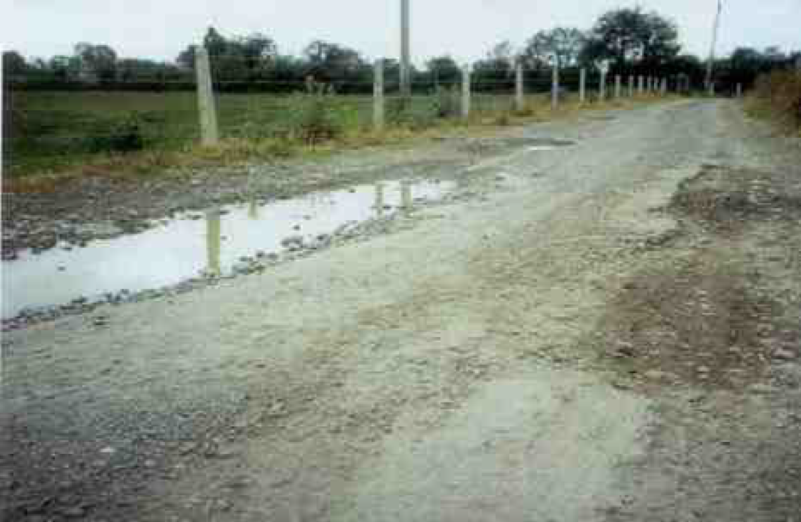

| **Metric**                   | **Ground Truth**     | **Model Prediction** |
|------------------------------|----------------------|----------------------|
| **Surface Defects (%)**      | 50.0                 | 50.0                 |
| **Pavement Defects (%)**     | 50.0                 | 50.0                 |
| **Structural Distresses (%)**| 80.0                 | 80.0                 |
| **Level (%)**                | **Level 1**          | **Level 1**          |

---

### Road Segment 22

<!-- 固定宽度 600px，可根据需要调整 -->
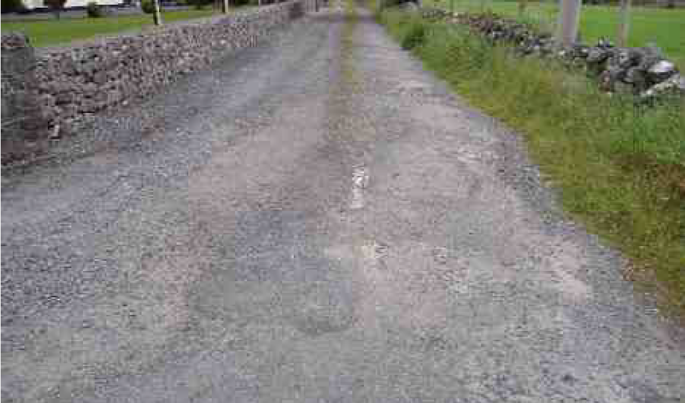

| **Metric**                   | **Ground Truth**     | **Model Prediction** |
|------------------------------|----------------------|----------------------|
| **Surface Defects (%)**      | 0.0                  | 0.0                  |
| **Pavement Defects (%)**     | 0.0                  | 0.0                  |
| **Structural Distresses (%)**| 50.0                 | 40.0                 |
| **Level (%)**                | **Level 2**          | **Level 3**          |

---

### Road Segment 23

<!-- 固定宽度 600px，可根据需要调整 -->
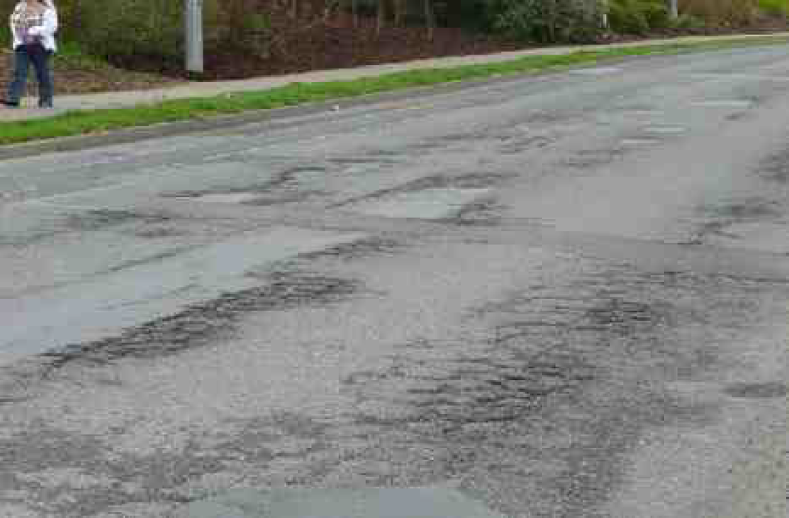

| **Metric**                   | **Ground Truth**     | **Model Prediction** |
|------------------------------|----------------------|----------------------|
| **Surface Defects (%)**      | 5.0                  | 0.0                  |
| **Pavement Defects (%)**     | 50.0                 | 0.0                  |
| **Structural Distresses (%)**| 40.0                 | 20.0                 |
| **Level (%)**                | **Level 3**          | **Level 4**          |

---

### Road Segment 24

<!-- 固定宽度 600px，可根据需要调整 -->
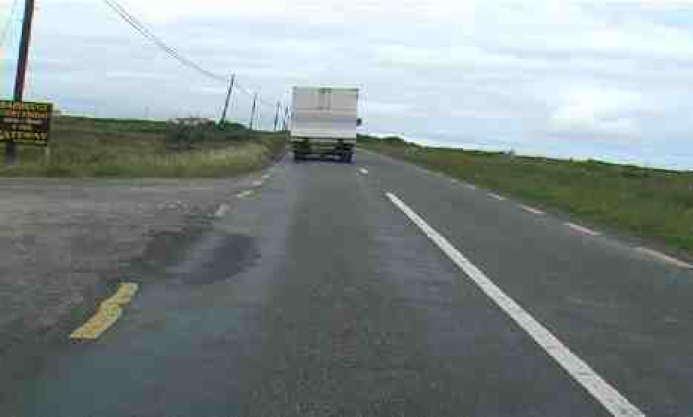

| **Metric**                   | **Ground Truth**     | **Model Prediction** |
|------------------------------|----------------------|----------------------|
| **Surface Defects (%)**      | 0.0                  | 0.0                 |
| **Pavement Defects (%)**     | 10.0                 | 10.0                 |
| **Structural Distresses (%)**| 5.0                  | 5.0                 |
| **Level (%)**                | **Level 4**          | **Level 5**          |

---

### Road Segment 25

<!-- 固定宽度 600px，可根据需要调整 -->
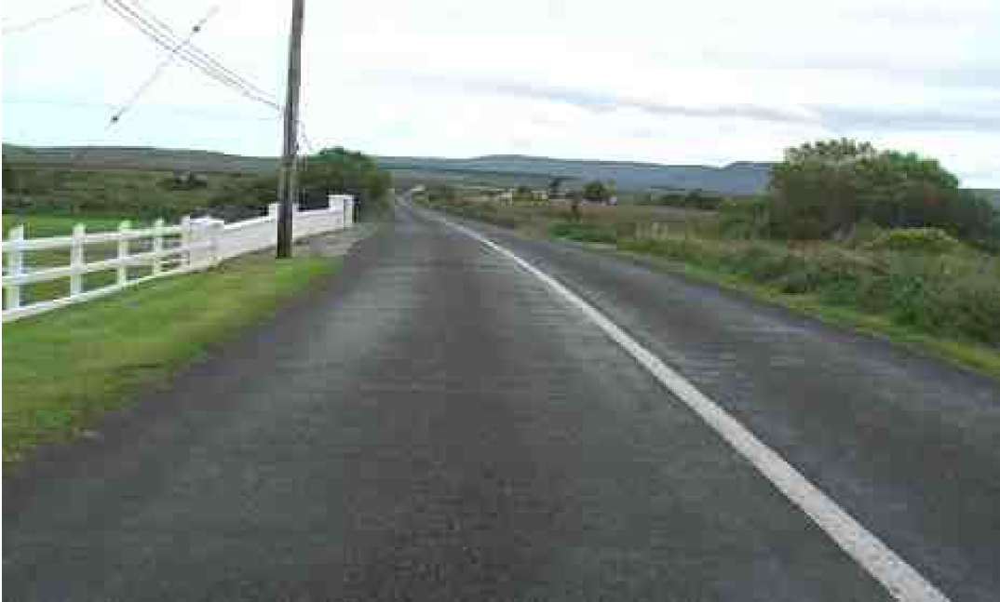

| **Metric**                   | **Ground Truth**     | **Model Prediction** |
|------------------------------|----------------------|----------------------|
| **Surface Defects (%)**      | 30.0                 | 5.0                  |
| **Pavement Defects (%)**     | 0.0                  | 0.0                  |
| **Structural Distresses (%)**| 20.0                 | 0.0                  |
| **Level (%)**                | **Level 5**          | **Level 9**          |

---

### Road Segment 26

<!-- 固定宽度 600px，可根据需要调整 -->
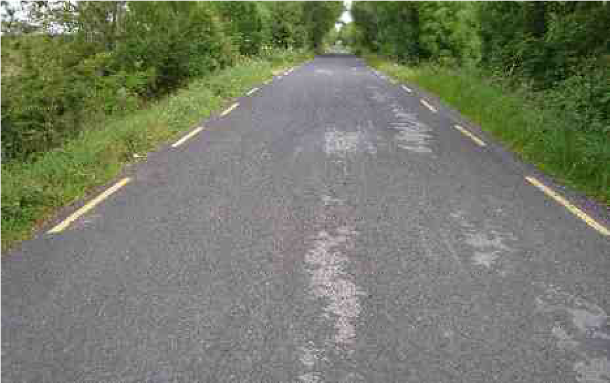

| **Metric**                   | **Ground Truth**     | **Model Prediction** |
|------------------------------|----------------------|----------------------|
| **Surface Defects (%)**      | 30.0                 | 20.0                 |
| **Pavement Defects (%)**     | 5.0                  | 0.0                  |
| **Structural Distresses (%)**| 0.0                  | 0.0                  |
| **Level (%)**                | **Level 6**          | **Level 8**          |

---

### Road Segment 27

<!-- 固定宽度 600px，可根据需要调整 -->
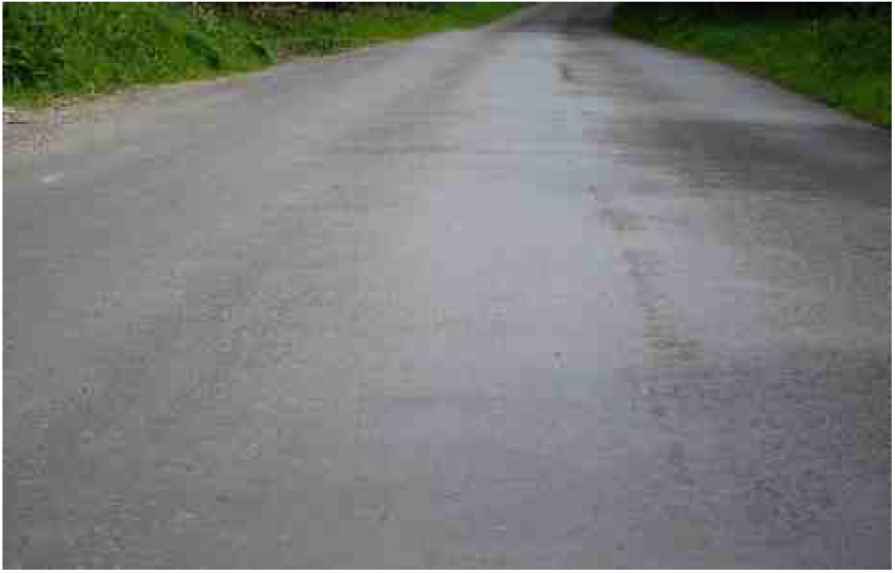

| **Metric**                   | **Ground Truth**     | **Model Prediction** |
|------------------------------|----------------------|----------------------|
| **Surface Defects (%)**      | 30.0                 | 5.0                  |
| **Pavement Defects (%)**     | 0.0                  | 0.0                  |
| **Structural Distresses (%)**| 0.0                  | 0.0                  |
| **Level (%)**                | **Level 7**          | **Level 9**          |

---

### Road Segment 28

<!-- 固定宽度 600px，可根据需要调整 -->
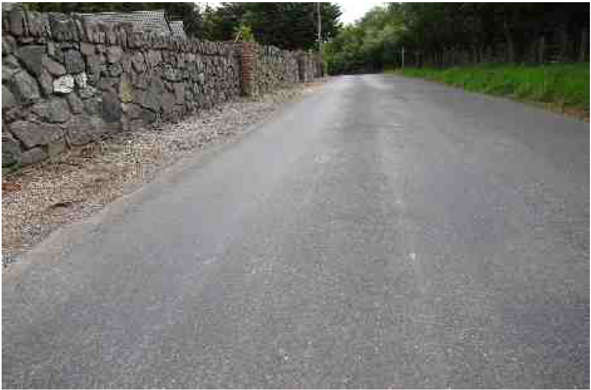

| **Metric**                   | **Ground Truth**     | **Model Prediction** |
|------------------------------|----------------------|----------------------|
| **Surface Defects (%)**      | 20.0                 | 5.0                  |
| **Pavement Defects (%)**     | 0.0                  | 0.0                  |
| **Structural Distresses (%)**| 0.0                  | 0.0                  |
| **Level (%)**                | **Level 8**          | **Level 9**          |

---

### Road Segment 29

<!-- 固定宽度 600px，可根据需要调整 -->
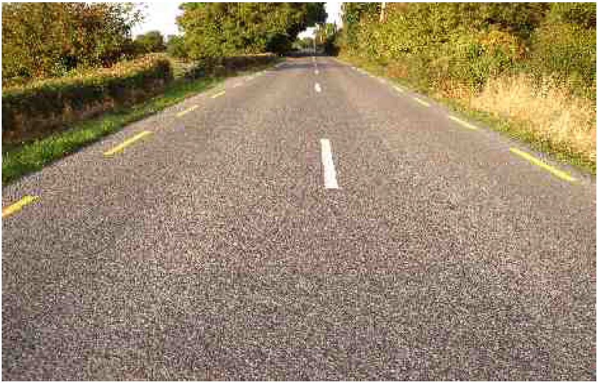

| **Metric**                   | **Ground Truth**     | **Model Prediction** |
|------------------------------|----------------------|----------------------|
| **Surface Defects (%)**      | 10.0                 | 5.0                  |
| **Pavement Defects (%)**     | 0.0                  | 0.0                  |
| **Structural Distresses (%)**| 0.0                  | 0.0                  |
| **Level (%)**                | **Level 9**          | **Level 9**          |

---

### Road Segment 30

<!-- 固定宽度 600px，可根据需要调整 -->
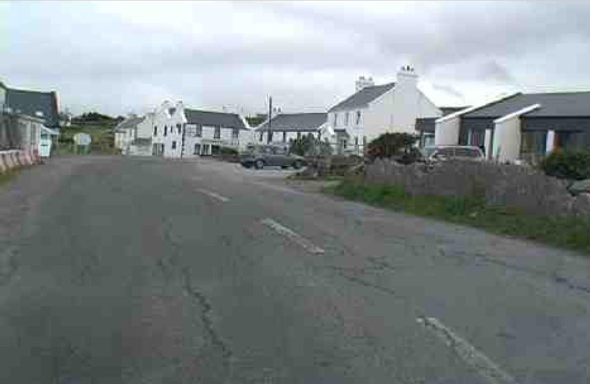

| **Metric**                   | **Ground Truth**     | **Model Prediction** |
|------------------------------|----------------------|----------------------|
| **Surface Defects (%)**      | 0.0                  | 15.0                 |
| **Pavement Defects (%)**     | 20.0                 | 10.0                 |
| **Structural Distresses (%)**| 25.0                 | 5.0                  |
| **Level (%)**                | **Level 3**          | **Level 5**          |

---

### Road Segment 31

<!-- 固定宽度 600px，可根据需要调整 -->
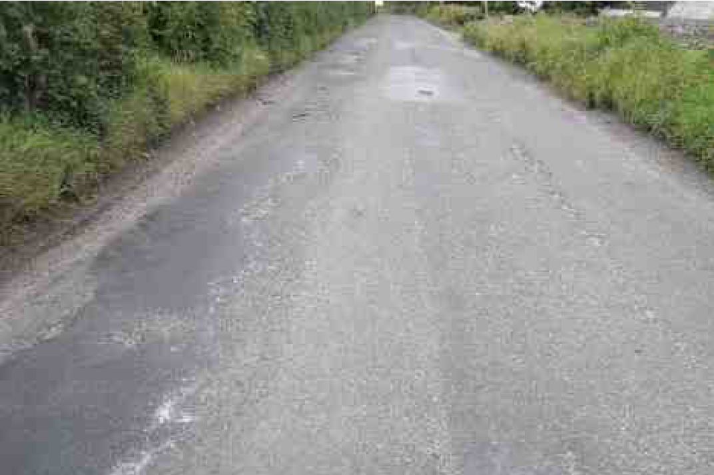

| **Metric**                   | **Ground Truth**     | **Model Prediction** |
|------------------------------|----------------------|----------------------|
| **Surface Defects (%)**      | 20.0                 | 30.0                 |
| **Pavement Defects (%)**     | 10.0                 | 10.0                 |
| **Structural Distresses (%)**| 15.0                 | 5.0                  |
| **Level (%)**                | **Level 4**          | **Level 5**          |

---

### Road Segment 32

<!-- 固定宽度 600px，可根据需要调整 -->
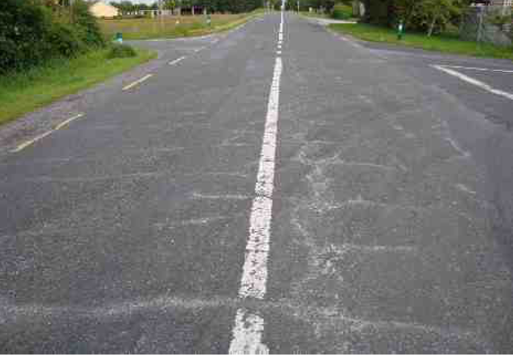

| **Metric**                   | **Ground Truth**     | **Model Prediction** |
|------------------------------|----------------------|----------------------|
| **Surface Defects (%)**      | 20.0                 | 15.0                 |
| **Pavement Defects (%)**     | 20.0                 | 0.0                  |
| **Structural Distresses (%)**| 0.0                  | 0.0                  |
| **Level (%)**                | **Level 5**          | **Level 6**          |

---

### Road Segment 33

<!-- 固定宽度 600px，可根据需要调整 -->
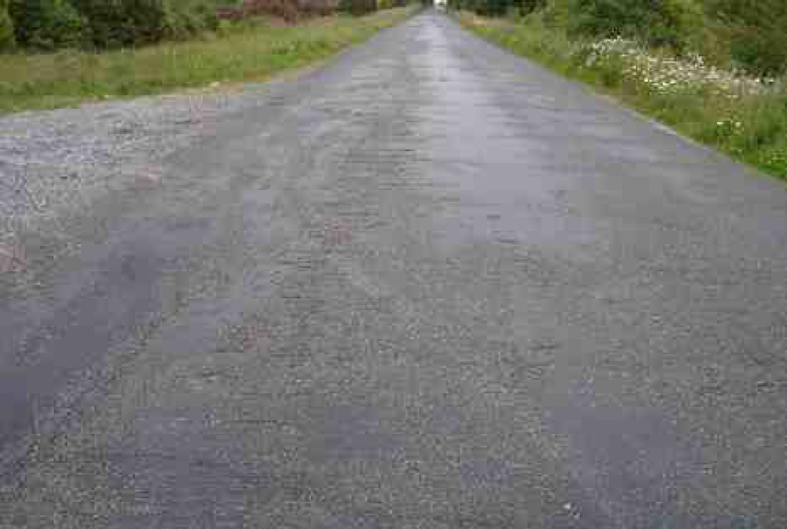

| **Metric**                   | **Ground Truth**     | **Model Prediction** |
|------------------------------|----------------------|----------------------|
| **Surface Defects (%)**      | 20.0                 | 20.0                 |
| **Pavement Defects (%)**     | 10.0                 | 0.0                  |
| **Structural Distresses (%)**| 0.0                  | 0.0                  |
| **Level (%)**                | **Level 6**          | **Level 8**          |

---

### Road Segment 34

<!-- 固定宽度 600px，可根据需要调整 -->
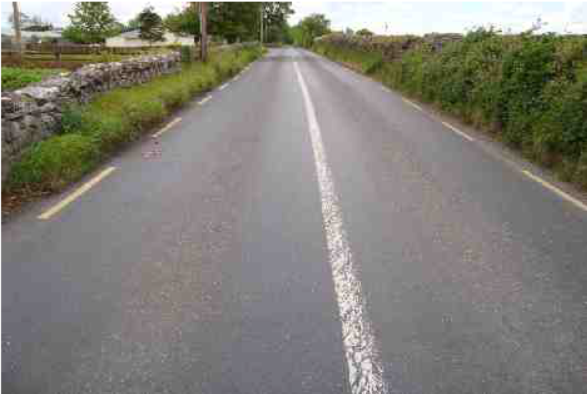

| **Metric**                   | **Ground Truth**     | **Model Prediction** |
|------------------------------|----------------------|----------------------|
| **Surface Defects (%)**      | 20.0                 | 5.0                  |
| **Pavement Defects (%)**     | 0.0                  | 0.0                  |
| **Structural Distresses (%)**| 0.0                  | 0.0                  |
| **Level (%)**                | **Level 7**          | **Level 9**          |

---

### Road Segment 35

<!-- 固定宽度 600px，可根据需要调整 -->
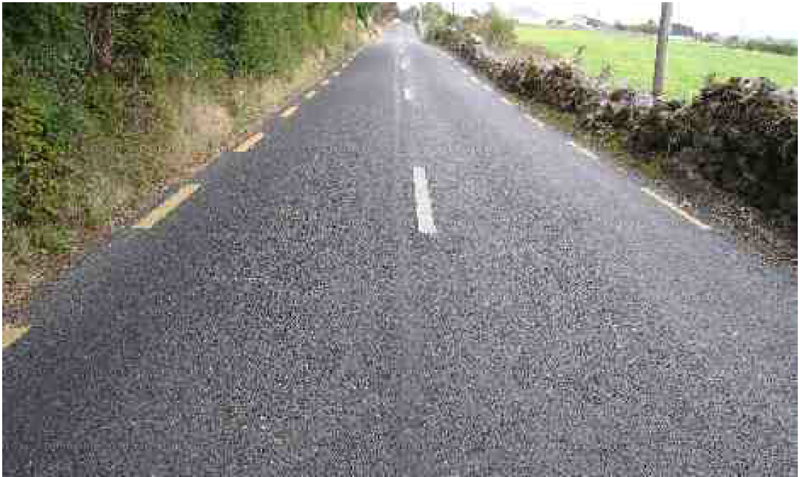

| **Metric**                   | **Ground Truth**     | **Model Prediction** |
|------------------------------|----------------------|----------------------|
| **Surface Defects (%)**      | 5.0                  | 5.0                  |
| **Pavement Defects (%)**     | 0.0                  | 0.0                  |
| **Structural Distresses (%)**| 0.0                  | 0.0                  |
| **Level (%)**                | **Level 9**          | **Level 9**          |

---

### Road Segment 36

<!-- 固定宽度 600px，可根据需要调整 -->
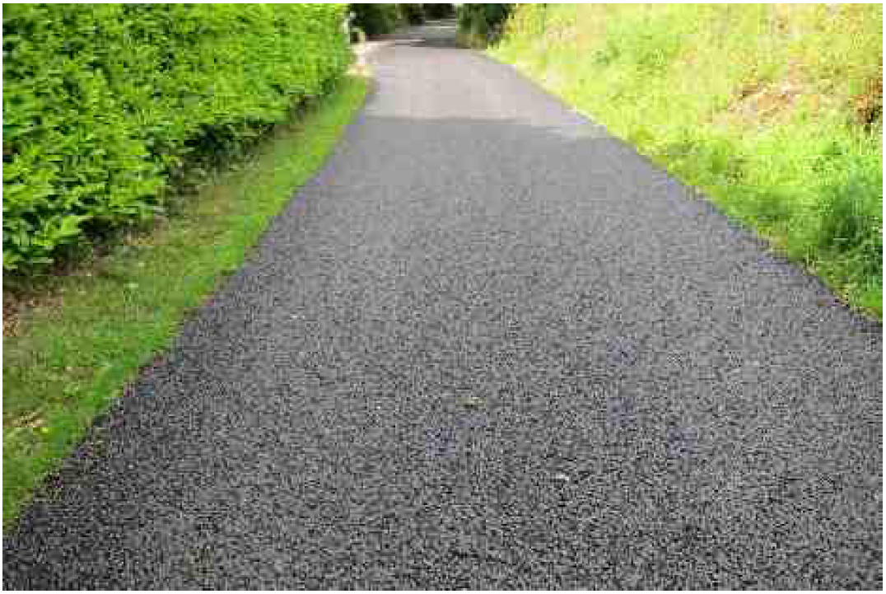

| **Metric**                   | **Ground Truth**     | **Model Prediction** |
|------------------------------|----------------------|----------------------|
| **Surface Defects (%)**      | 0.0                  | 0.0                  |
| **Pavement Defects (%)**     | 0.0                  | 0.0                  |
| **Structural Distresses (%)**| 0.0                  | 0.0                  |
| **Level (%)**                | **Level 10**         | **Level 10**         |

---

### Road Segment 37

<!-- 固定宽度 600px，可根据需要调整 -->
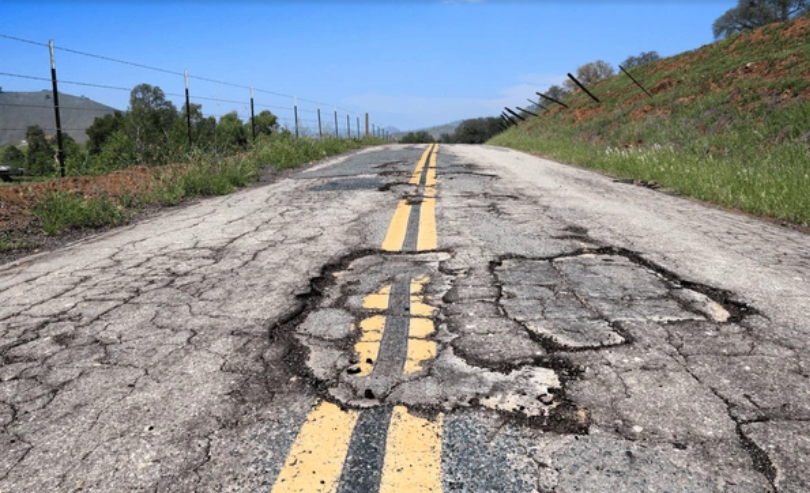

| **Metric**                   | **Ground Truth**     | **Model Prediction** |
|------------------------------|----------------------|----------------------|
| **Surface Defects (%)**      | 0.0                  | 0.0                  |
| **Pavement Defects (%)**     | 20.0                 | 0.0                  |
| **Structural Distresses (%)**| 80.0                 | 60.0                 |
| **Level (%)**                | **Level 1**          | **Level 2**          |

---

### Road Segment 38

<!-- 固定宽度 600px，可根据需要调整 -->
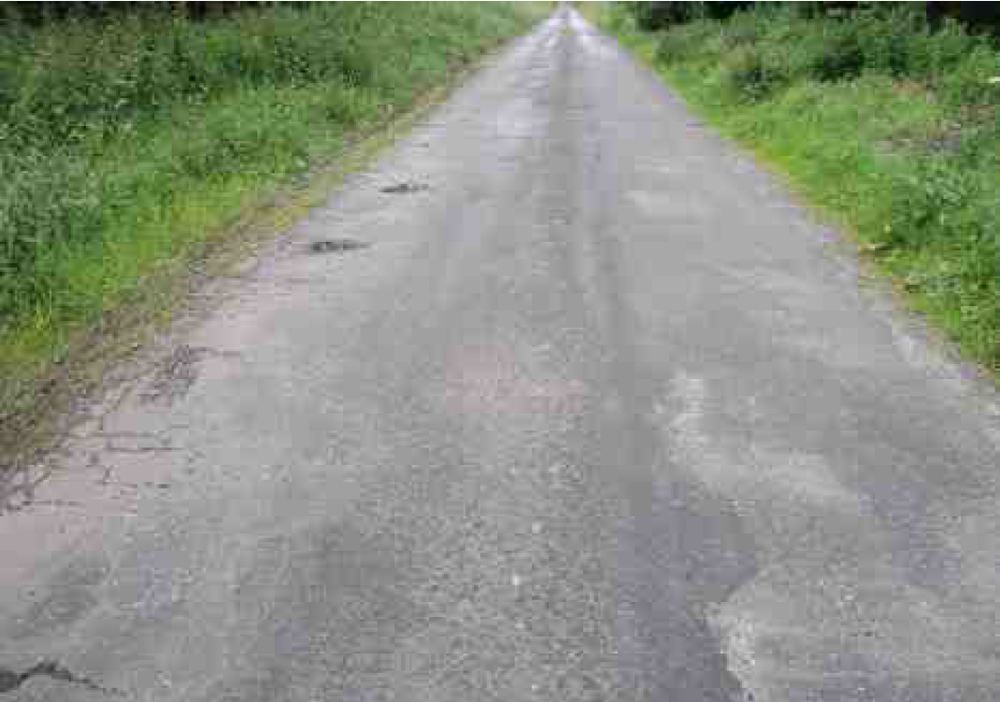

| **Metric**                   | **Ground Truth**     | **Model Prediction** |
|------------------------------|----------------------|----------------------|
| **Surface Defects (%)**      | 20.0                 | 0.0                  |
| **Pavement Defects (%)**     | 10.0                 | 10.0                 |
| **Structural Distresses (%)**| 25.0                 | 15.0                 |
| **Level (%)**                | **Level 3**          | **Level 5**          |

---

### Road Segment 39

<!-- 固定宽度 600px，可根据需要调整 -->
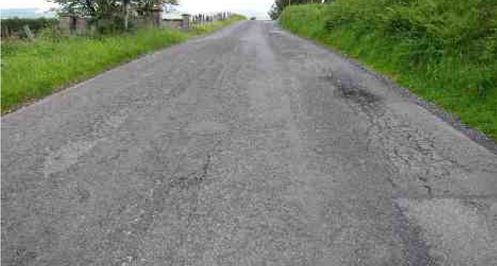

| **Metric**                   | **Ground Truth**     | **Model Prediction** |
|------------------------------|----------------------|----------------------|
| **Surface Defects (%)**      | 20.0                 | 30.0                 |
| **Pavement Defects (%)**     | 15.0                 | 0.0                  |
| **Structural Distresses (%)**| 5.0                  | 0.0                  |
| **Level (%)**                | **Level 4**          | **Level 5**          |

---

### Road Segment 40

<!-- 固定宽度 600px，可根据需要调整 -->
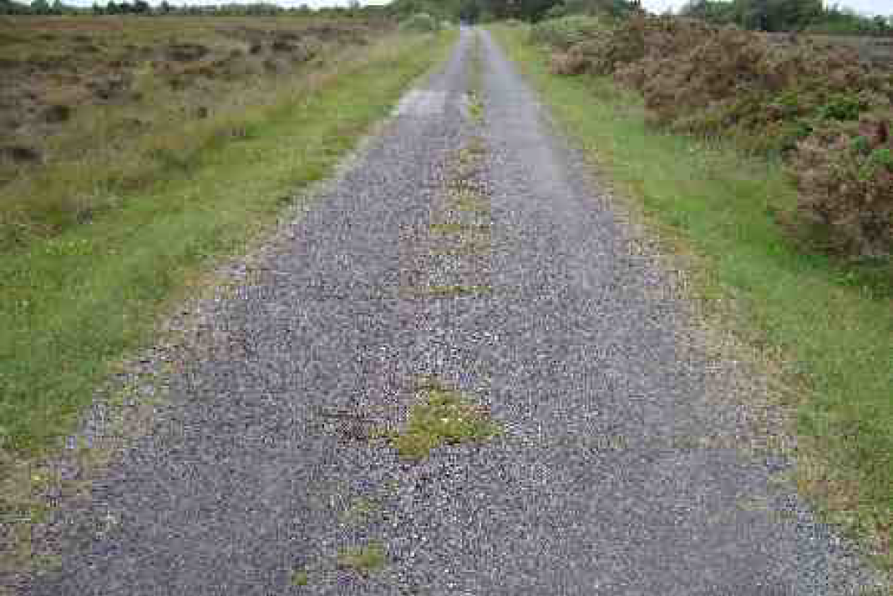

| **Metric**                   | **Ground Truth**     | **Model Prediction** |
|------------------------------|----------------------|----------------------|
| **Surface Defects (%)**      | 30.0                 | 40.0                 |
| **Pavement Defects (%)**     | 15.0                 | 0.0                 |
| **Structural Distresses (%)**| 0.0                  | 10.0                 |
| **Level (%)**                | **Level 6**          | **Level 4**          |

---

### Road Segment 41

<!-- 固定宽度 600px，可根据需要调整 -->
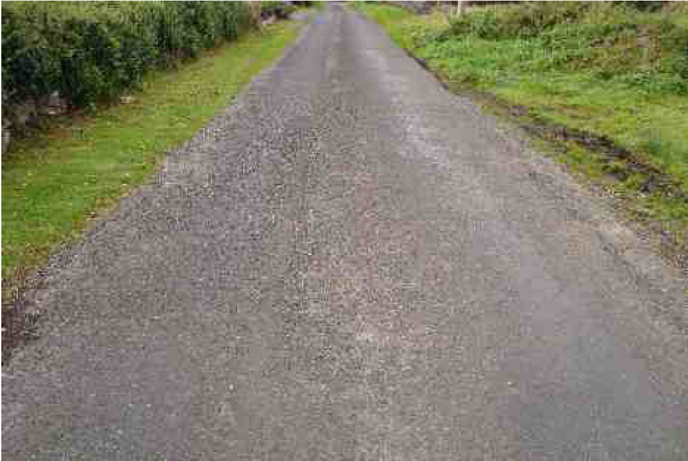

| **Metric**                   | **Ground Truth**     | **Model Prediction** |
|------------------------------|----------------------|----------------------|
| **Surface Defects (%)**      | 40.0                 | 40.0                 |
| **Pavement Defects (%)**     | 0.0                  | 0.0                  |
| **Structural Distresses (%)**| 0.0                  | 0.0                  |
| **Level (%)**                | **Level 7**          | **Level 7**          |

---

### Road Segment 42

<!-- 固定宽度 600px，可根据需要调整 -->
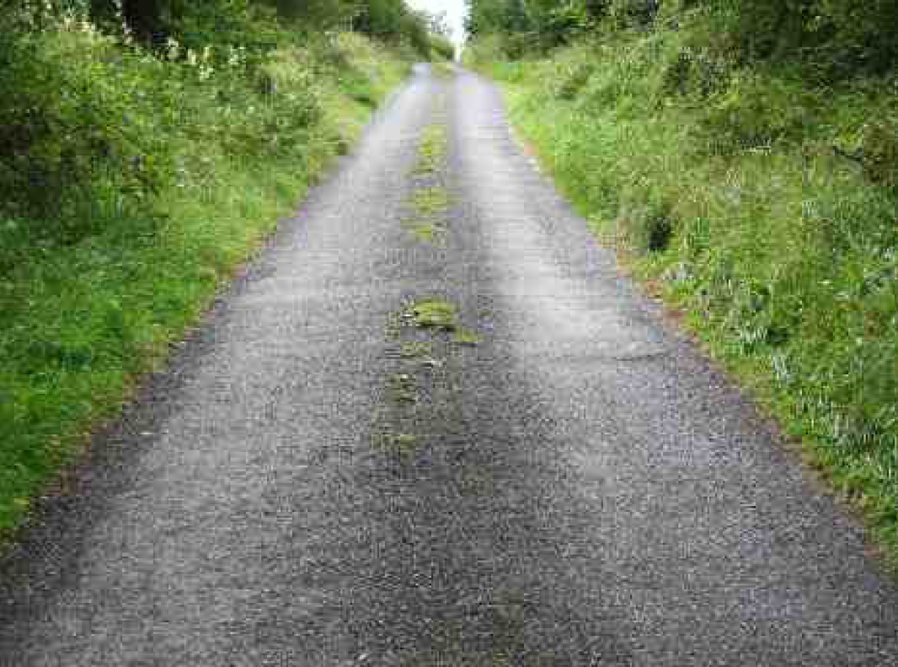

| **Metric**                   | **Ground Truth**     | **Model Prediction** |
|------------------------------|----------------------|----------------------|
| **Surface Defects (%)**      | 50.0                 | 20.0                 |
| **Pavement Defects (%)**     | 0.0                  | 0.0                  |
| **Structural Distresses (%)**| 0.0                  | 0.0                  |
| **Level (%)**                | **Level 7**          | **Level 6**          |

---
