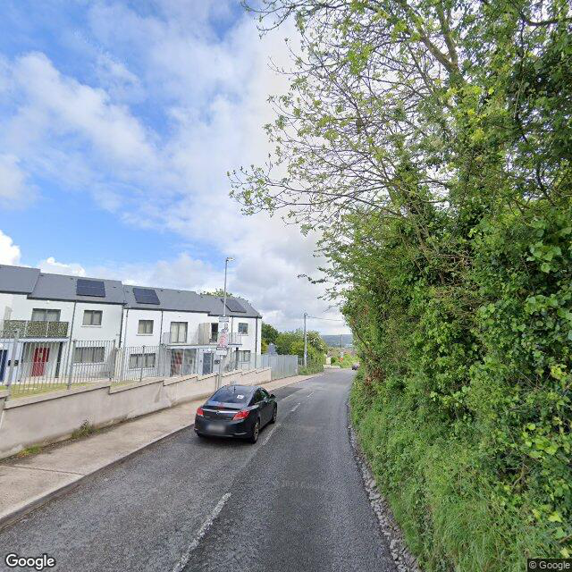
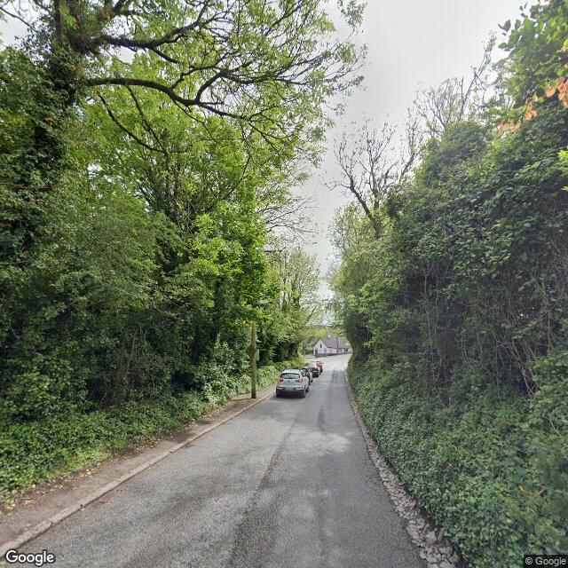

## Pavement Damage Detection Report (Dataset 2)

### PSCI Evaluation (Model 5)

---

### Road Segment 43

<!-- 固定宽度 600px，可根据需要调整 -->

| **Surface Defects (%)** | **Pavement Defects (%)** | **Structural Distresses (%)** | **Level** |
| :---------------------: | :----------------------: | :---------------------------: | :-------: |
|           50.0          |           50.0           |              80.0             |  Level 1  |

---

### Road Segment 44

<!-- 固定宽度 600px，可根据需要调整 -->

| **Surface Defects (%)** | **Pavement Defects (%)** | **Structural Distresses (%)** | **Level** |
| :---------------------: | :----------------------: | :---------------------------: | :-------: |
|           0.0           |            0.0           |              60.0             |  Level 2  |
