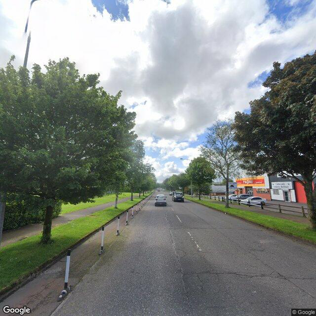
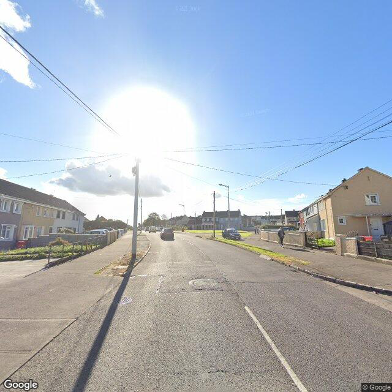
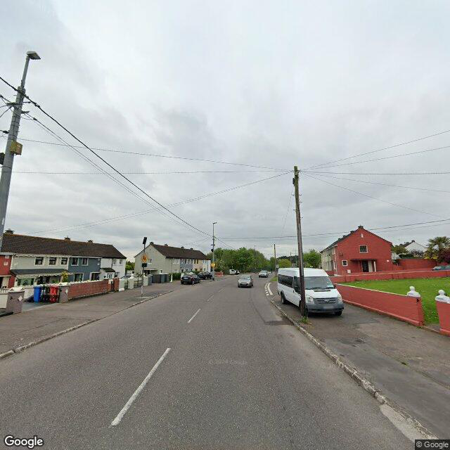

## Pavement Damage Detection Report (Dataset 2)

### PSCI Evaluation (Model 5)

---

### Road Segment 43 (Level 5)

<!-- 固定宽度 600px，可根据需要调整 -->

---

### Road Segment 44 (Level 6)

<!-- 固定宽度 600px，可根据需要调整 -->

---

### Road Segment 45 (Level 9)

<!-- 固定宽度 600px，可根据需要调整 -->

---

### Road Segment 46 (Level 6)

<!-- 固定宽度 600px，可根据需要调整 -->

---

### Road Segment 47 (Level 4)

<!-- 固定宽度 600px，可根据需要调整 -->

---

### Road Segment 48 (Level 8)

<!-- 固定宽度 600px，可根据需要调整 -->

---

### Road Segment 49 (Level 8)

<!-- 固定宽度 600px，可根据需要调整 -->

---

### Road Segment 50 (Level 7)

<!-- 固定宽度 600px，可根据需要调整 -->

---

### Road Segment 51 (Level 7)

<!-- 固定宽度 600px，可根据需要调整 -->

---

### Road Segment 52 (Level 6)

<!-- 固定宽度 600px，可根据需要调整 -->

---

### Road Segment 53 (Level 5)

<!-- 固定宽度 600px，可根据需要调整 -->

---

### Road Segment 54 (Level 8)

<!-- 固定宽度 600px，可根据需要调整 -->

---

### Road Segment 55 (Level 8)

<!-- 固定宽度 600px，可根据需要调整 -->

---

### Road Segment 56 (Level 8)

<!-- 固定宽度 600px，可根据需要调整 -->

---

### Road Segment 57 (Level 9)

<!-- 固定宽度 600px，可根据需要调整 -->

---

### Road Segment 58 (Level 5)

<!-- 固定宽度 600px，可根据需要调整 -->

---

### Road Segment 59 (Level 9)

<!-- 固定宽度 600px，可根据需要调整 -->

---

### Road Segment 60 (Level 7)

<!-- 固定宽度 600px，可根据需要调整 -->

---

### Road Segment 61 (Level 9)

<!-- 固定宽度 600px，可根据需要调整 -->

---

### Road Segment 62 (Level 8)

<!-- 固定宽度 600px，可根据需要调整 -->

---

### Road Segment 63 (Level 9)

<!-- 固定宽度 600px，可根据需要调整 -->

---

### Road Segment 64 (Level 9)

<!-- 固定宽度 600px，可根据需要调整 -->

---

### Road Segment 65 (Level 5)

<!-- 固定宽度 600px，可根据需要调整 -->

---

### Road Segment 66 (Level 8)

<!-- 固定宽度 600px，可根据需要调整 -->

---

### Road Segment 67 (Level 9)

<!-- 固定宽度 600px，可根据需要调整 -->

---

### Road Segment 68 (Level 8)

<!-- 固定宽度 600px，可根据需要调整 -->

---

### Road Segment 69 (Level 4)

<!-- 固定宽度 600px，可根据需要调整 -->

---

### Road Segment 70 (Level 8)

<!-- 固定宽度 600px，可根据需要调整 -->

---

### Road Segment 71 (Level 4)

<!-- 固定宽度 600px，可根据需要调整 -->

---

### Road Segment 72 (Level 4)

<!-- 固定宽度 600px，可根据需要调整 -->

---

### Road Segment 73 (Level 5)

<!-- 固定宽度 600px，可根据需要调整 -->

---

### Road Segment 74 (Level 8)

<!-- 固定宽度 600px，可根据需要调整 -->

---

### Road Segment 75 (Level 5)

<!-- 固定宽度 600px，可根据需要调整 -->

---

### Road Segment 76 (Level 6)

<!-- 固定宽度 600px，可根据需要调整 -->

---

### Road Segment 77 (Level 4)

<!-- 固定宽度 600px，可根据需要调整 -->

---

### Road Segment 78 (Level 6)

<!-- 固定宽度 600px，可根据需要调整 -->

---

### Road Segment 79 (Level 7)

<!-- 固定宽度 600px，可根据需要调整 -->

---

### Road Segment 80 (Level 5)

<!-- 固定宽度 600px，可根据需要调整 -->

---

### Road Segment 81 (Level 4)

<!-- 固定宽度 600px，可根据需要调整 -->

---

### Road Segment 83 (Level 4)

<!-- 固定宽度 600px，可根据需要调整 -->

---

### Road Segment 84 (Level 8)

<!-- 固定宽度 600px，可根据需要调整 -->

---

### Road Segment 86 (Level 7)

<!-- 固定宽度 600px，可根据需要调整 -->

---

### Road Segment 87 (Level 4)

<!-- 固定宽度 600px，可根据需要调整 -->

---

### Road Segment 88 (Level 7)

<!-- 固定宽度 600px，可根据需要调整 -->

---

### Road Segment 89 (Level 8)

<!-- 固定宽度 600px，可根据需要调整 -->

---

### Road Segment 90 (Level 7)

<!-- 固定宽度 600px，可根据需要调整 -->

---

### Road Segment 91 (Level 5)

<!-- 固定宽度 600px，可根据需要调整 -->

---

### Road Segment 92 (Level 6)

<!-- 固定宽度 600px，可根据需要调整 -->

---

### Road Segment 93 (Level 7)

<!-- 固定宽度 600px，可根据需要调整 -->

---

### Road Segment 94 (Level 8)

<!-- 固定宽度 600px，可根据需要调整 -->

---

### Road Segment 96 (Level 7)

<!-- 固定宽度 600px，可根据需要调整 -->

---

### Road Segment 97 (Level 5)

<!-- 固定宽度 600px，可根据需要调整 -->

---

### Road Segment 98 (Level 6)

<!-- 固定宽度 600px，可根据需要调整 -->

---

### Road Segment 100 (Level 8)

<!-- 固定宽度 600px，可根据需要调整 -->

 

---

### Road Segment 101 (Level 8)

<!-- 固定宽度 600px，可根据需要调整 -->

 

---

### Road Segment 102 (Level 8)

<!-- 固定宽度 600px，可根据需要调整 -->

 

---

### Road Segment 103 (Level 7)

<!-- 固定宽度 600px，可根据需要调整 -->

 

---

### Road Segment 104 (Level 4)

<!-- 固定宽度 600px，可根据需要调整 -->

 

---

### Road Segment 105 (Level 8)

<!-- 固定宽度 600px，可根据需要调整 -->

 

---

### Road Segment 106 (Level 7)

<!-- 固定宽度 600px，可根据需要调整 -->

 

---

### Road Segment 107 (Level 7)

<!-- 固定宽度 600px，可根据需要调整 -->

 

---

### Road Segment 108 (Level 4)

<!-- 固定宽度 600px，可根据需要调整 -->

 

---

### Road Segment 109 (Level 7)

<!-- 固定宽度 600px，可根据需要调整 -->

 

---

### Road Segment 110 (Level 5)

<!-- 固定宽度 600px，可根据需要调整 -->

 

---

### Road Segment 111 (Level 7)

<!-- 固定宽度 600px，可根据需要调整 -->

 

---

### Road Segment 112 (Level 7)

<!-- 固定宽度 600px，可根据需要调整 -->

 

---

### Road Segment 113 (Level 6)

<!-- 固定宽度 600px，可根据需要调整 -->

 

---

### Road Segment 114 (Level 7)

<!-- 固定宽度 600px，可根据需要调整 -->

 

---

### Road Segment 115 (Level 7)

<!-- 固定宽度 600px，可根据需要调整 -->

 

---

### Road Segment 116 (Level 8)

<!-- 固定宽度 600px，可根据需要调整 -->

 

---

### Road Segment 117 (Level 8)

<!-- 固定宽度 600px，可根据需要调整 -->

 

---

### Road Segment 118 (Level 7)

<!-- 固定宽度 600px，可根据需要调整 -->

 

---

### Road Segment 119 (Level 9)

<!-- 固定宽度 600px，可根据需要调整 -->

 

---

### Road Segment 120 (Level 7)

<!-- 固定宽度 600px，可根据需要调整 -->

 

---

### Road Segment 121 (Level 9)

<!-- 固定宽度 600px，可根据需要调整 -->

 

---

### Road Segment 122 (Level 8)

<!-- 固定宽度 600px，可根据需要调整 -->

 

---

### Road Segment 123 (Level 7)

<!-- 固定宽度 600px，可根据需要调整 -->

 

