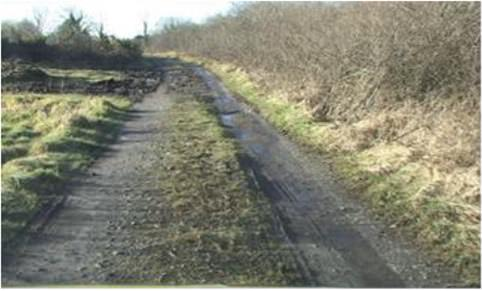

# Pavement Damage Detection Report
## PSCI Evaluation

---

## Sample Entry

### Road Segment 1

<!-- 固定宽度 600px，可根据需要调整 -->

| Metric                   | Ground Truth (%)     | Model Prediction (%) | Level (GT → Pred)    |
|--------------------------|----------------------|----------------------|----------------------|
| Surface Defects          | `10` | `<Pred_surface_defects>` | `<GT_Level>` → `<Pred_Level>` |
| Pavement Defects         | `<GT_pavement_defects>` | `<Pred_pavement_defects>` |                      |
| Structural Distresses    | `<GT_structural_distresses>` | `<Pred_structural_distresses>` |                      |

---

## Additional Entries

### Road Segment 2

| Metric                   | Ground Truth (%)     | Model Prediction (%) | Level (GT → Pred)    |
|--------------------------|----------------------|----------------------|----------------------|
| Surface Defects          | `<GT_surface_defects>` | `<Pred_surface_defects>` | `<GT_Level>` → `<Pred_Level>` |
| Pavement Defects         | `<GT_pavement_defects>` | `<Pred_pavement_defects>` |                      |
| Structural Distresses    | `<GT_structural_distresses>` | `<Pred_structural_distresses>` |                      |

---

<!--  
使用说明：
1. 将所有图片放在 Dataset_x/ 文件夹下，并确保路径正确（区分大小写）。
2. 将 `<GT_…>`、`<Pred_…>` 和 `<GT_Level>`、`<Pred_Level>` 替换为你的真实数值，例如：
   - GT_surface_defects: 12.5
   - Pred_surface_defects: 11.8
   - GT_Level: Level 2
   - Pred_Level: Level 2
3. 调整 `` 的 width 值以控制显示大小。  
4. 新增更多 Road Segment 时，复制 “Additional Entries” 段落即可。
-->  
